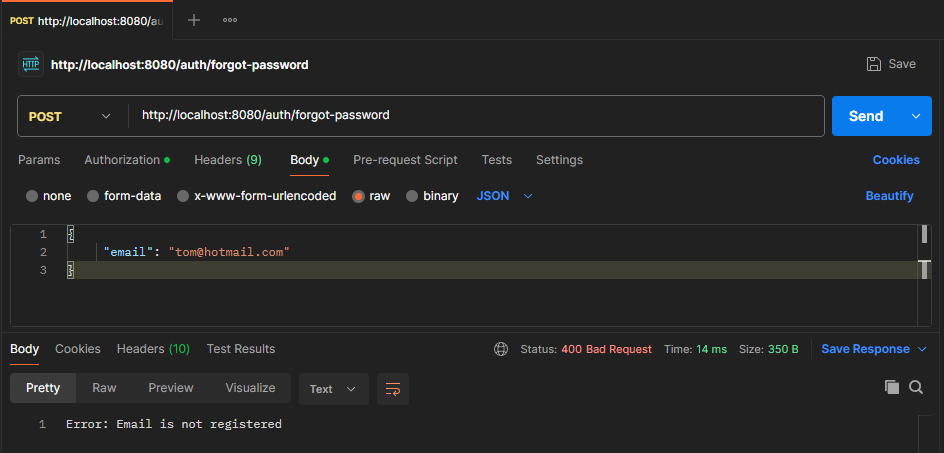

# 💰 Sistema Bancário com Spring Boot

Este projeto é uma API RESTful de sistema bancário, desenvolvida com Java e Spring Boot. Ele foi projetado para oferecer de forma segura e robusta operações de um ambiente bancário, como cadastro de clientes, criação de contas, autenticação, transações e muito mais.

A aplicação permite o cadastro de clientes, que é o primeiro passo obrigatório para acesso ao sistema. Somente após o registro do cliente é possível criar credenciais de login e acessar as funcionalidades internas da plataforma. Isso garante que apenas usuários devidamente identificados possam interagir com os serviços bancários disponíveis.

Após o cadastro, o cliente pode criar sua própria conta de usuário (login e senha) e, de forma automática, uma conta corrente é gerada para ele. Essa conta é vinculada diretamente ao seu perfil, estabelecendo um relacionamento entre as entidades do sistema (Cliente → Conta).

---

## ⚙️ O sistema oferece funcionalidades como:  
• ✅ Autenticação com JWT, protegendo rotas sensíveis como operações bancárias.  
• 🏦 Abertura automática de conta corrente no ato do cadastro de login.  
• 💸 Operações de depósito e saque, disponíveis apenas após autenticação.  
• 🔒 Regra de segurança que impede um usuário de operar em contas de terceiros.  
• 🗄️ Banco de dados configurado com PostgreSQL e suporte a H2 em memória para testes rápidos.  
• 📧 Envio de e-mails via Mailtrap para simular o processo de recuperação de senha.

O objetivo principal do projeto é oferecer uma estrutura limpa, modular e extensível, com foco em boas práticas de arquitetura e segurança, incluindo:

• 🧱 Separação clara de camadas (Controller, Service, Repository, Model).  
• ✅ Validações com Jakarta Bean Validation.  
• 🔐 Criptografia e manipulação segura de dados sensíveis.

---

## 🛠️ Tecnologias Utilizadas
• ☕ Java: Linguagem base do projeto.  
• ⚙️ Spring Boot Framework para construção da aplicação backend.  
• 🔐 Spring Security: Implementação de autenticação e autorização baseada em JWT.  
• 🗃️ Spring Data JPA + Hibernate: Persistência de dados e mapeamento objeto-relacional.  
• 🧪 H2 Database: Banco de dados relacional em memória para testes rápidos.  
• 🐘 PostgreSQL: Banco de dados real utilizado em produção.  
• ✅ Jakarta Validation (Bean Validation): Validação das entidades e dados de entrada.  
• 🛡️ JWT (JSON Web Tokens): Emissão e validação de tokens para sessões seguras.  
• 📬 JavaMailSender: Serviço para envio assíncrono de e-mails (simulado via Mailtrap ou SMTP).  
• 📦 Maven: Gerenciamento das dependências e build do projeto.  
• 📮 Postman: Plataforma para testes das requisições HTTP (GET, POST, PUT, DELETE) da API RESTful.

---

## 🚀 Métodos Principais da API do Sistema Bancário

### 1. 👤 ClientController — Gerenciamento dos Clientes  
• POST /clients — save(Client client)  
Cadastra um novo cliente com validação dos dados.

• GET /clients — list()  
Lista todos os clientes cadastrados.

• GET /clients/{id} — getClientById(Long id)  
Retorna os dados do cliente pelo ID.

• PUT /clients/{id} — clientUpdate(Long id, Client updatedClient)  
Atualiza os dados de um cliente existente.

• DELETE /clients/{id} — deleteClient(Long id)  
Remove o cliente do sistema.

---

### 2. 🏦 CurrentAccountController — Operações na Conta Corrente  
• GET /current-account/balance?email= — getBalance(String email)  
Consulta o saldo da conta corrente do cliente autenticado pelo email.

• POST /current-account/deposit/{accountId} — deposit(Long accountId, CurrentAccountTransactionRequest request, Authentication auth)  
Realiza depósito em uma conta específica, validando se o usuário é dono da conta.

• POST /current-account/withdraw/{accountId} — withdraw(Long accountId, CurrentAccountTransactionRequest request, Authentication auth)  
Realiza saque, validando saldo e propriedade da conta.

---

### 3. 🔐 UserLoginController — Autenticação e Recuperação de Senha  
• POST /auth/signup — createPassword(AuthRequest request)  
Cria a senha do usuário e automaticamente gera a conta corrente associada (com saldo zero e número único).

• POST /auth/login — login(LoginRequest request)  
Faz login via email e senha, retornando token JWT em caso de sucesso.

• POST /auth/forgot-password — forgotPassword(ForgotPasswordRequest request)  
Inicia o processo de recuperação de senha, enviando email com link e token.

• POST /auth/reset-password — resetPassword(ResetPasswordRequest request)  
Permite redefinir a senha usando token válido.

---

### 4. ⚙️ UserLoginService — Lógica de Negócio para Usuário e Conta  
• createPassword(email, password)  
Cria credenciais de usuário com senha criptografada.  
Gera automaticamente uma conta corrente vinculada ao cliente com saldo zero e número único (chamando generateAccountNumber()).

• generateAccountNumber()  
Método privado que gera um número único para conta corrente, combinando número aleatório e timestamp.  
Garante unicidade e evita conflitos na criação das contas.

• login(email, password)  
Autentica o usuário e retorna token JWT.

• forgotPassword(email)  
Cria token de recuperação, armazena e envia email.

• resetPassword(token, newPassword)  
Valida token e atualiza senha do usuário.

---

### 5. 💼 CurrentAccountService — Operações Bancárias  
• deposit(accountId, email, amount)  
Deposita valor em conta após validação de saldo e propriedade da conta.

• withdraw(accountId, email, amount)  
Realiza saque com validações similares.

• getBalance(email)  
Retorna saldo da conta vinculada ao email.

---

### 6. 👥 ClientService — Gerenciamento dos Dados dos Clientes  
• save(client)  
Salva um novo cliente.

• list()  
Retorna lista completa de clientes.

• findById(id)  
Busca cliente por ID.

• updateClient(id, updatedClient)  
Atualiza cliente, incluindo atualização do email nas credenciais.

• deleteClient(id)  
Remove cliente do banco.

---

## 📁 Estrutura do Projeto

### 🧩 Pacotes Principais  
• model: Entidades JPA que representam o domínio do sistema (Cliente, Conta, Usuário, Token).  
• repository: Interfaces de acesso a dados via Spring Data JPA.  
• service: Regras de negócio e lógica da aplicação, incluindo serviços de usuário, cliente, conta corrente e email.  
• exception: Classes para tratamento de exceções customizadas e controlador global.  
• dto: Objetos para transferência de dados nas requisições REST (ex: AuthRequest, ForgotPasswordRequest).  
• config: Configurações do Spring Security, JWT e autenticação.  
• controller: Endpoints REST responsáveis por expor as funcionalidades da API, como login, cadastro, operações bancárias e recuperação de senha.
• utils: Classe utilitária responsável pela serialização personalizada de valores monetários, garantindo exibição no formato desejado nas respostas da API.

---

## 🧬 Modelos / Entidades

### 👤 Client (Cliente)  
• Atributos: id, name, age, address, email, salary.  
• Relacionamentos:  
  ◦ Possui uma lista de Account (contas bancárias) — relacionamento OneToMany.  
  ◦ Possui um UserLogin (credenciais para autenticação) — relacionamento OneToOne.  
• Validações via annotations (ex: @NotBlank, @NotNull).  
• Métodos para adicionar, listar, atualizar e remover Client.

### 🏦 Account (Conta Bancária)  
• Classe base para diferentes tipos de conta (herança JPA JOINED).  
• Atributos: id, number (número da conta), balance, createDate.  
• Relacionamento ManyToOne com Client.  
• Subclasse: CurrentAccount (Conta Corrente).

### 🔑 UserLogin  
• Contém email, password (criptografada) e relacionamento OneToOne com Client.  
• Controla o acesso do usuário ao sistema.

### 🔐 PasswordResetToken  
• Guarda o token de redefinição de senha, o email do usuário e a data de expiração.  
• Controla o fluxo seguro da funcionalidade "Esqueci a senha".

---

## 🧾 Funcionalidades Principais

### 1. 📋 Cadastro de Cliente e Criação de Usuário com Conta Corrente  
• Clientes são cadastrados com seus respectivos dados.  
• Usuários são criados com senha criptografada via BCrypt.  
• Ao criar o usuário, automaticamente uma conta corrente associada ao cliente é criada, com saldo zero e número gerado randomicamente.  
• A criação do usuário só é possível se o cliente já estiver cadastrado no sistema.

### 2. 🔐 Autenticação via JWT  
• Usuários fazem login informando email e senha.  
• Em caso de sucesso, é gerado um token JWT válido para autenticação nas requisições subsequentes, como depósito e saque.  
• Tratamento de exceções para login inválido.

### 3. 💸 Gestão de Conta Corrente  
• Operações de depósito e saque com validações rigorosas:  
  ◦ Depósitos devem ser positivos.  
  ◦ Saques só podem ser realizados se o saldo for suficiente.  
  ◦ Cada operação valida se o usuário está operando sobre a própria conta.

### 4. 🔁 Recuperação de Senha – Funcionalidade “Esqueci a Senha” 
• O usuário solicita recuperação informando seu email.  
• Caso o email esteja registrado, é gerado um token UUID único com validade de 30 minutos.  
• Um link contendo o token é enviado por e-mail ao usuário.  
• O usuário pode redefinir sua senha utilizando o token recebido.  
• O sistema valida se o token é válido e não expirou.  
• Após a redefinição, o token é removido para evitar reutilização.

### 5. 🧯 Tratamento de Exceções  
• Exceções customizadas para recursos não encontrados, dados inválidos e transações inválidas.  
• Erros de validação retornados em JSON, com campos detalhados e mensagens claras.  
• O uso de @RestControllerAdvice garante consistência nas respostas de erro.  
• Mensagens padronizadas também são tratadas para situações específicas, como:  
  ◦ Usuário inexistente ou senha inválida durante o login.  
  ◦ Email não registrado.  
  ◦ Autenticação obrigatória.  
  ◦ Senha não pode estar vazia.  
  ◦ Campos obrigatórios não preenchidos são validados e retornados com mensagens específicas.

---

## 🧠 Detalhes Técnicos e Considerações

### 🔐 Segurança  
• Senhas sempre criptografadas com BCryptPasswordEncoder.  
• Autenticação com AuthenticationManager do Spring Security.  
• Uso de JWT para autenticação e autorização de endpoints.  
• O serviço UserLoginService gerencia login, criação de senha, reset de senha e geração do token JWT.

### 🔄 Relacionamentos e Serialização JSON  
• Uso de @JsonManagedReference e @JsonBackReference para evitar loops infinitos durante a serialização.  
• Herança JPA entre Account e CurrentAccount, permitindo expansão para outros tipos de conta futuramente.

### 🗃️ Banco de Dados  
• H2 em memória facilita testes e desenvolvimento rápido.  
• Entidades mapeadas com JPA + Hibernate para persistência transparente.  
• Uso do banco PostgreSQL real em ambiente de produção.  
• Configuração dinâmica no projeto permite alternar entre H2 e PostgreSQL conforme a necessidade do ambiente, com simples ajustes no application.properties

### 📬 Envio de Email  
• Serviço EmailService usa JavaMailSender para envio assíncrono de e-mails.  
• Configurável para SMTP real ou ambiente de testes como Mailtrap.  
• E-mails enviados para recuperação de senha com link contendo o token.

### 💸 Formatação de valores monetários com Jackson
• Para melhorar a experiência das respostas da API e tornar os valores financeiros mais legíveis e profissionais, foi implementada uma serialização personalizada usando o Jackson:

---

## 📫 Testes com Postman e Endpoints Disponíveis

Para testar a API, recomenda-se o uso do Postman, ferramenta onde você pode simular todas as requisições REST da aplicação.

### 🔐 Autenticação (/auth)

| Método | Endpoint               | Descrição                                        |
|--------|------------------------|-------------------------------------------------|
| POST   | /auth/signup           | Criação de senha para o usuário (após cadastro do cliente). |
| POST   | /auth/login            | Autenticação com email e senha, retorna token JWT. |
| POST   | /auth/forgot-password  | Inicia processo de recuperação de senha.        |
| POST   | /auth/reset-password   | Redefine a senha com o token enviado por email. |

### 👤 Cliente (/clients)

| Método | Endpoint        | Descrição               |
|--------|-----------------|-------------------------|
| POST   | /clients        | Cadastra novo cliente.  |
| GET    | /clients        | Lista todos os clientes.|
| GET    | /clients/{id}   | Busca cliente pelo ID.  |
| PUT    | /clients/{id}   | Atualiza dados do cliente. |
| DELETE | /clients/{id}   | Remove cliente pelo ID. |

### 🏦 Conta Corrente (/current-account)

| Método | Endpoint                         | Descrição                       |
|--------|---------------------------------|--------------------------------|
| GET    | /current-account/balance?email= | Consulta saldo da conta do cliente. |
| POST   | /current-account/deposit/{accountId} | Realiza um depósito na conta. (JWT necessário) |
| POST   | /current-account/withdraw/{accountId} | Realiza um saque na conta. (JWT necessário) |

---

## 🏦 Imagens do Projeto Bancário

